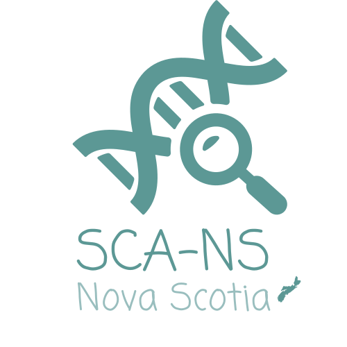

<h1 style="text-align: center"> Welcome to SCA-NS </h1>

<h2 style="text-align: center"> Nova Scotia's Surveillance of Congenital Anomalies </h2>

<!-- > An interactive open source tool on the prevalence of congenital anomalies in Nova Scotia, Canada, (built in [R](https://cran.r-project.org) with [shiny]("https://shiny.rstudio.com)). -->

<!-- 
 -->

<!-- > **Surveillance of Congenital Anomalies** enables intuitive, rapid and reproducible population-based data on congenital anomalies that will provide information to improve the health of Nova Scotia children and their families. -->

<!-- 
 -->

<!--  > **WHAT YOU CAN DO WITH this app:** -->
<!-- * Provide data on occurrence. -->
<!-- * Identify populations at increased risk. -->
<!-- * Monitor changes in occurrence. -->
<!-- * Investigate clusters. -->
<!-- * Identify geographic variation and localized clustering of congenital anomalies in Nova Scotia. -->
<!-- * Create research opportunities. -->

<!-- 
 -->

<!-- > If you have any question, please contact [Cora Cole](mailto:cora.cole@iwk.nshealth.ca), [John Fahey](mailto:john.fahey@iwk.nshealth.ca), or [Estevam Teixeira](mailto:estevam.teixeira@iwk.nshealth.ca). -->

  &copy; 2024 | All Rights Reserved | Built with &#x2764; by
  <a style="color: #4D9B9A;" href="http://rcp.nshealth.ca/">
    <strong>Reproductive Care Program of Nova Scotia</strong>
  </a>
  <!-- &#x1f341; -->

