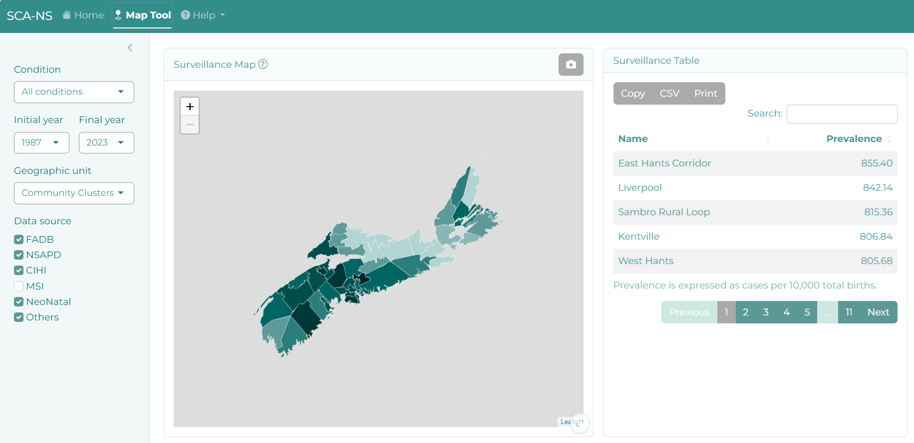
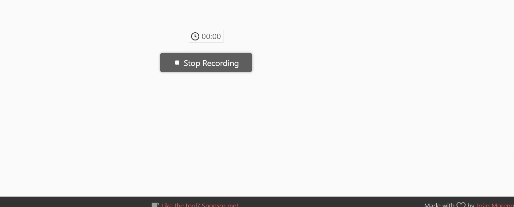

```{r, include = FALSE}
knitr::opts_chunk$set(
  message = FALSE,
  echo = FALSE,
  collapse = TRUE,
  comment = "#>",
  # fig.path = "www/images/vignettes",
  out.width = "100%",
  fig.align = 'center'
)
library(bsicons)
```

This document serves as a user guide for the `r bsicons::bs_icon("geo-fill")` **Map Tool** view, offering detailed explanations of the fields and filters employed in constructing this perspective.

It offers users insights into the geographical distribution of congenital anomalies within Nova Scotia. By leveraging data visualization, users can explore the prevalence of conditions across Nova Scotia's counties, communities, clusters, and health zones.

<figure>
  <center>
    
  </center>
  <figcaption style="text-align: center;">Map tab overview.</figcaption>
</figure>

## Navigation

### Sidebar

`r bsicons::bs_icon("geo-fill")` **Map Tool** incorporates 4 filters:

1. **Condition:** Users can filter conditions by scrolling, typing the Q code, or entering the anomaly name.

2. **Initial and Final Year:** This filter exclusively presents options available in the database for the specified condition. Importantly, it restricts the selection to scenarios where the final year is not earlier than the initial year.

3. **Geographic unit:** Users are provided with four options:
   1. [**Census Division:**](https://www12.statcan.gc.ca/census-recensement/2021/ref/dict/az/definition-eng.cfm?ID=geo008) This represents a comprehensive term for provincially legislated areas, encompassing entities such as counties, municipalités régionales de comté (MRC), and regional districts.
   
   2. [**Community Clusters:**](http://healthatlas.ca/Home/ClusterReport) These are newly developed area units based on aggregated census Dissemination Areas (DAs), intended to closely align with community activities.
   3. [**Community Health Networks:**](http://healthatlas.ca/Home/ClusterReport) These geographic units derive from aggregated community clusters and serve as a mechanism for fostering connections across all health system and community partners. They facilitate linkages across various care settings, including hospitals, communities, and long-term care facilities.
   4. [**Health Management Zones:**](http://healthatlas.ca/Home/ClusterReport) Exclusive to Nova Scotia Health Authority (NSHA), these management zones support local health services leadership, management, and delivery. They are developed considering typical service access, practitioner referral patterns, and other boundaries pertinent to service planning and delivery.

4. **Data Source:** Choose from available database options tailored to your selected condition and time period. Your choice impacts prevalence values and content displayed in the upset plot across the entire page.

<figure>
  <center>

  </center>
  <figcaption style="text-align: center;">Sidebar.</figcaption>
</figure>

### Surveillance Map / Surveillance Table

The map is accompanied by a table that presents prevalence data by geographic unit. The table is ordered by prevalence, providing a clear understanding of the distribution of congenital anomalies across different regions.

#### Interactive Features

Users can click on specific shapes on the map to zoom in on a particular area. The corresponding geography will be highlighted in the table for enhanced visibility.

The same can be achieved with the table. Clicking on a specific line in the table highlights the respective geography on the map. This two-way interaction enhances user engagement and understanding.

Additionally, map and table can be expanded to full screen (look for this symbol  on the bottom right).

<figure>
  <center>
    
  </center>
  <figcaption style="text-align: center;">Interactive map and table.</figcaption>
</figure>

Users have the flexibility to download both table and map information, enabling them to further analyze and utilize the data as needed.

By seamlessly integrating maps and tables with interactive features, this view empowers users to explore and comprehend the geographical aspects of congenital anomalies in Nova Scotia.

<p style="bottom: 0; width: 100%;">
  &copy; 2024 | All Rights Reserved | Built with &#x2764; by
  <a style="color: #4D9B9A;" href="http://rcp.nshealth.ca/">
    <strong>Reproductive Care Program of Nova Scotia</strong>
  </a>
</p>
