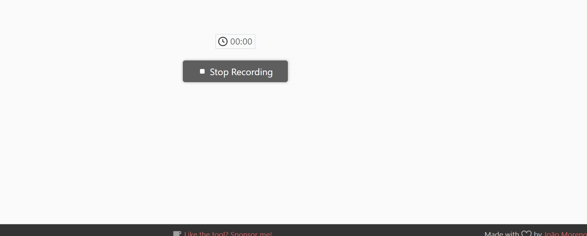

```{r, include = FALSE}
knitr::opts_chunk$set(
  message = FALSE,
  echo = FALSE,
  collapse = TRUE,
  comment = "#>",
  # fig.path = "www/images/vignettes",
  out.width = "100%",
  fig.align = 'center'
)
library(bsicons)
```

This document serves as a user guide for the `r bsicons::bs_icon("list-ul")` **Summary** view, offering detailed explanations of the fields and filters employed in constructing this perspective.

<figure>
  <center>
    
  </center>
  <figcaption style="text-align: center;">Summary tab overview.</figcaption>
</figure>

## Navigation

### Sidebar

`r bsicons::bs_icon("list-ul")` **Summary** incorporates three filters:

1. **Condition:** Users can filter conditions by scrolling, typing the Q code, or entering the anomaly name.

2. **Initial and Final Year:** The year options are restricted to those available in the database for the selected condition. Additionally, it is not possible to set the final year to be earlier than the initial year.

3. **Data Source:** Choose from available database options tailored to your selected condition and time period. Your choice impacts prevalence values and content displayed in the upset plot across the entire page.

<figure>
  <center>

  </center>
  <figcaption style="text-align: center;">Sidebar.</figcaption>
</figure>

### Value Boxes

Value boxes serve as a dynamic tool for presenting pivotal metrics and condensed information in a dashboard. They significantly enhance the user experience by offering a clear and concise method to highlight essential numerical insights.

Additionally, the `Total births` and, when `All conditions` is selected, `Reported congenital anomalies`, can be expanded to full screen (look for this symbol  on the bottom right). These three value boxes seamlessly adapt to user filter selections, providing real-time reflections of the chosen parameters.

<figure>
  <center>

  </center>
  <figcaption style="text-align: center;">Value boxes.</figcaption>
</figure>

### Data source

[UpSet](https://upset.app/) plots offer a powerful visualization technique tailored for datasets featuring more than three intersecting sets. The matrix layout of UpSet illustrates intersections, where rows represent sets and columns depict intersections between these sets (or vice versa). Bar charts accompany the matrix, presenting the sizes of both sets and intersections.

In this context, UpSet serves a dual purpose. First, it provides users with a visual understanding of the relationships among various data sources. Second, it functions as an indicator for data quality checks by confirming that identical patient information aligns across diverse sources.

Additionally, users possess the flexibility to interact with the plots by clicking on any of the three visualizations. This action highlights all sets related to the selected relationship, offering a dynamic and insightful exploration of the dataset.

<figure>
  <center>
    
  </center>
  <figcaption style="text-align: center;">Interactive Upset plot.</figcaption>
</figure>

Furthermore, users can conveniently download the plot as a PNG image by clicking on the camera icon (`r bsicons::bs_icon("camera")`) located on the upper right side of the plot.

<p style="bottom: 0; width: 100%;">
  &copy; 2024 | All Rights Reserved | Built with &#x2764; by
  <a style="color: #4D9B9A;" href="http://rcp.nshealth.ca/">
    <strong>Reproductive Care Program of Nova Scotia</strong>
  </a>
</p>
