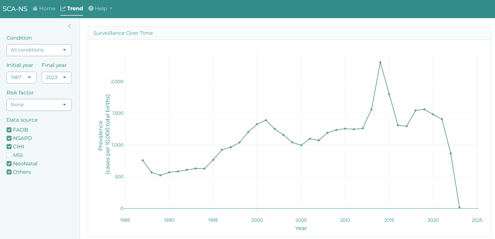
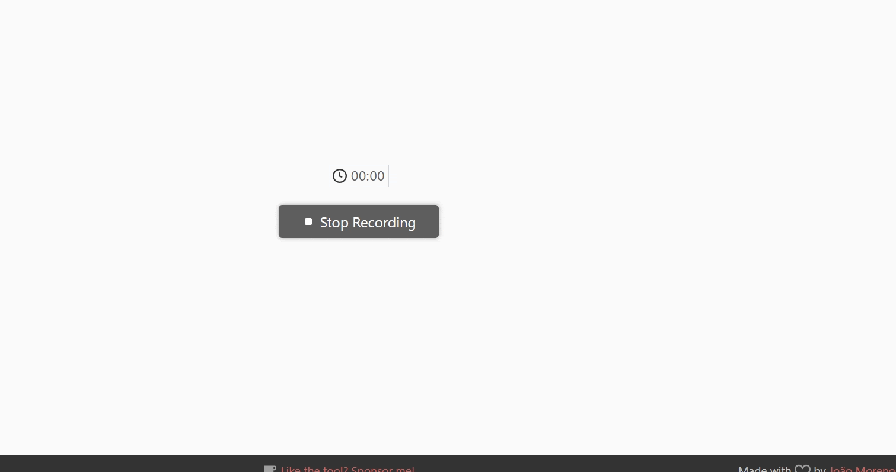

This document serves as a user guide for the `r bsicons::bs_icon("graph-up-arrow")` **Trend** view, offering detailed explanations of the fields and filters employed in constructing this perspective.

<figure>
  

    
  

  <figcaption style="text-align: center;">Trend tab overview.</figcaption>
</figure>

## Navigation

### Sidebar

`r bsicons::bs_icon("graph-up-arrow")` **Trend** incorporates 4 filters:

1. **Condition:** Users can filter conditions by scrolling, typing the Q code, or entering the anomaly name.

2. **Initial and Final Year:** This filter exclusively presents options available in the database for the specified condition. Importantly, it restricts the selection to scenarios where the final year is not earlier than the initial year.

3. **Risk Factor:** Users are provided with eight options:
   1. **None**
   2. **Alcohol Use**
       * Yes/No
   3. **BMI**
       * Not Obese (BMI < 30)
       * Obese I, II (BMI 30-39.9)
       * Obese III (BMI 40+)
   4. **Cannabis Use**
       * Yes/No
   5. **Diabetes**
       * Yes/No
   6. **Fetal Sex**
       * Male/Female
   7. **Maternal Age**
       * Age < 35
       * Age 35+
   8. **Smoking Use**
       * Yes/No
   
4. **Data Source:** Choose from available database options tailored to your selected condition and time period. Your choice impacts prevalence values and content displayed in the upset plot across the entire page.

<figure>
  

  

  <figcaption style="text-align: center;">Sidebar.</figcaption>
</figure>

### Surveillance Over Time

The lineplot is used to visualize how the prevalence changes or trends over the years. Each data point corresponds to a specific time point, and the lines connecting them show the overall trend or pattern of change over the specified time period.

#### Interactive Features

Users have the to reveal more information about a data point by moving their mouse cursor over the point and having a hover label appear.

<figure>
  

    
  

  <figcaption style="text-align: center;">Interactive Lineplot.</figcaption>
</figure>

The plot can be expanded to full screen (look for this symbol  on the bottom right).

Furthermore, users can conveniently download the plot as a PNG image by clicking on the camera icon (`r bsicons::bs_icon("camera")`) located on the upper right side of the plot.

  &copy; 2024 | All Rights Reserved | Built with &#x2764; by
  <a style="color: #4D9B9A;" href="http://rcp.nshealth.ca/">
    <strong>Reproductive Care Program of Nova Scotia</strong>
  </a>

